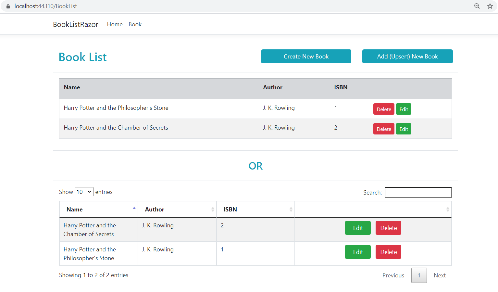
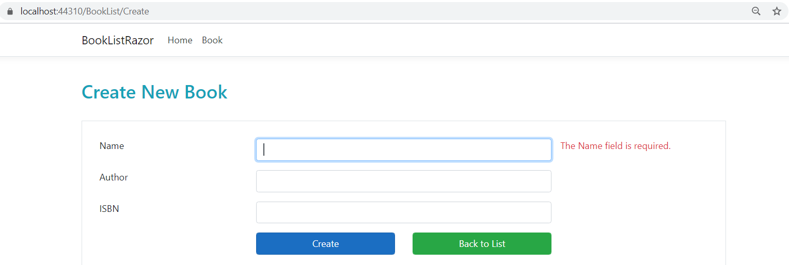
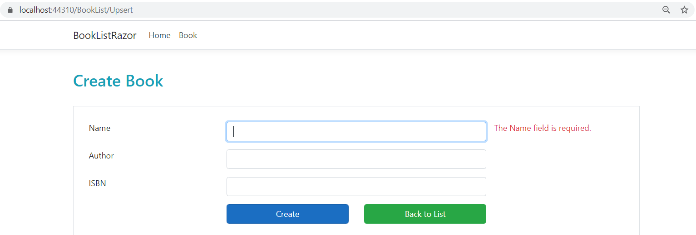
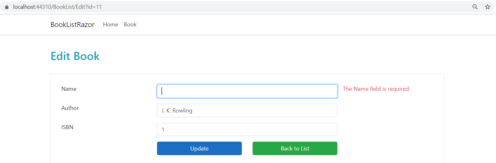
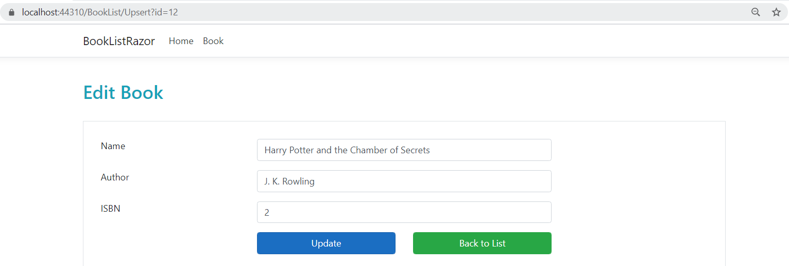
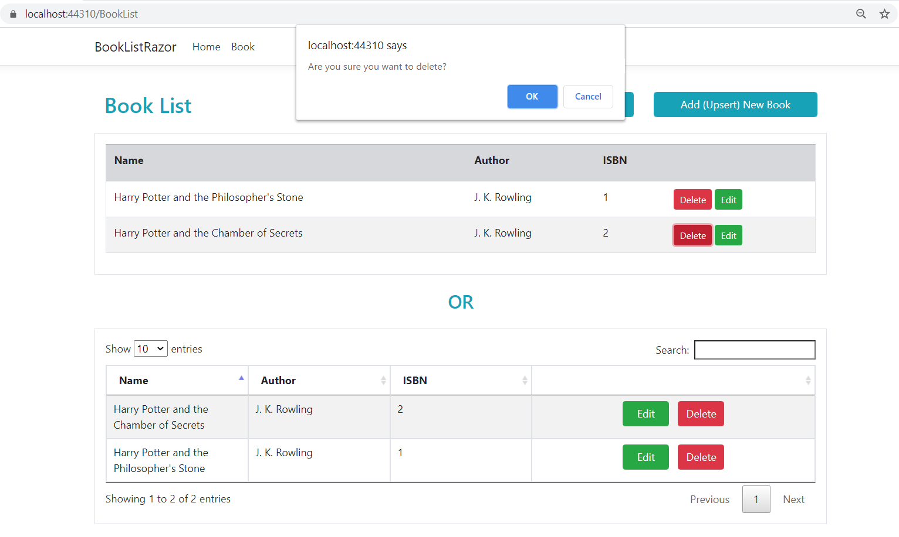
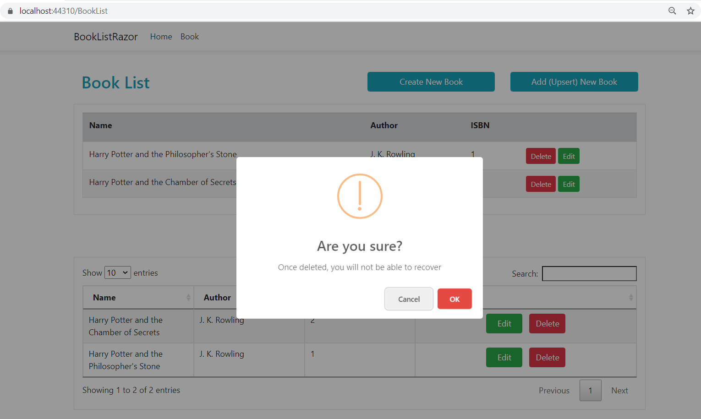
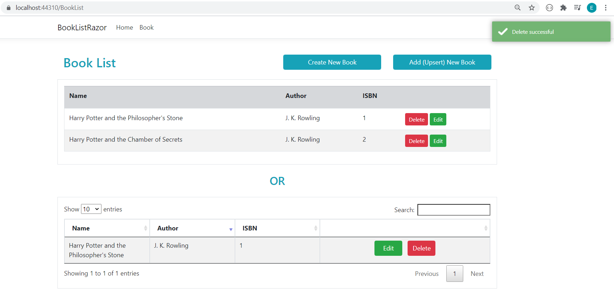

# Book List Razor: ASP.NET Core 3.1 with Razor Pages
In this project, I followed the Udemy tutorial https://www.udemy.com/course/introduction-to-aspnet-core-x.

I created a book list project where I implemented CRUD operations using Entity Framework Core.
This project is created using ASP.NET Core Razor Pages.

Users can add new books to the book list, update books as well as deleting them in this project.
Users can also search books in the DataTables version of book list.

## Development Environment

ASP.NET Core 3.1 SDK and Sql Server as database are used during project development.
In order to communicate with the database, necessary Entity Framework Core packages are used.
During development, code first database migration approach is embraced.

As a result, ASP.NET Core 3.1 SDK and Sql Server are required to run this project.

## Screenshots

### Index

<i>Image 1: Index Page</i>

 

This is the main page of the project where existing books are listed.
There are two tables with different styles of the same book list.
On this page, users can navigate to certain pages in order to create books or edit them.
Users can also delete books on this page.

There are two buttons on the upper right side of the page.
One of them redirects user to the Create page and the other one redirects user to the Upsert page.
Both pages allow user to create new books.
The reason for Upsert page to exist is to combine Create and Edit page functionalities into a single page as a second option.

The first table is created with default style.
If user clicks Edit on a certain book, user reaches the Edit page.
If user clicks Delete on a certain book, confirm box opens and user proceeds.

The second table is created using third party libraries such as *DataTables*, *SweetAlert* and *Toastr*.
If user clicks Edit on a certain book, this time user reaches the Upsert page in order to edit the book.
If user clicks Delete on a certain book, SweetAlert is triggered.
When delete operation is confirmed by the user, Toastr messages are shown.

### Create and Upsert (Create)

<i>Image 2: Create Page</i>

 

<i>Image 3: Upsert Page</i>

 

If user clicks on the Create New Book button, Create page opens.
If user clicks on the Add (Upsert) New Book button, Upsert page opens.
On both of these pages, user can add a new book to the book list.
Both client and server side validations are implemented.
Successful creation will redirect user to the Index page where the added book can be seen.
If user wants to opt out, Back to List button also redirects user to the Index page without any creation.

### Edit and Upsert (Edit)

<i>Image 4: Edit Page</i>

 

<i>Image 5: Upsert Page</i>

 

If user clicks on Edit button of a certain book in the first table on Index page, Edit page opens.
Similarly, if user clicks on Edit button of a certain book in the second table on Index page, Upsert page opens.
On both of these pages, user can edit fields of that specific book and save changes.
Both client and server side validations are implemented.
A successful update operation will redirect user to the Index page where edited fields can be seen.
If user wants to opt out, Back to List button also redirects user to the Index page without any editing done.

### Delete

<i>Image 6: Delete operation on the first table</i>

 

If user clicks on Delete button of a certain book in the first table, default confirm box opens for delete operation.
If user proceeds to delete, the book is removed from the list. If user opts out, no changes are made.

<i>Image 7: Delete operation on the second table</i>

 

<i>Image 8: Toastr alert</i>

 

If user clicks on Delete button of a certain book in the second table, an alert (SweetAlert) is shown.
Successful delete operation will remove the book from the list.
If user wants to opt out, no changes are made.
Delete operation results are shown to user using Toastr messages.